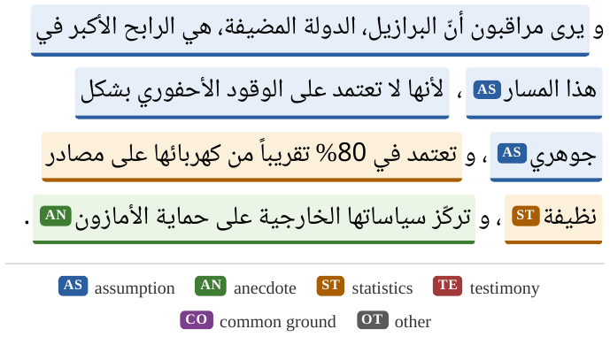
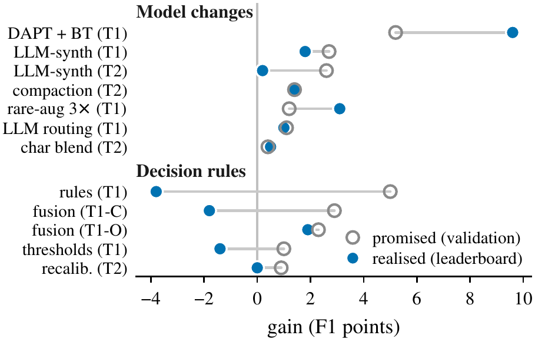
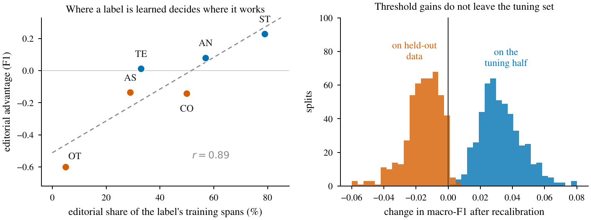
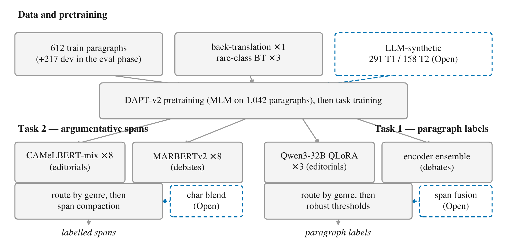

# Durham-Jazan at Daleel 2026

This repository accompanies the Durham-Jazan system description paper for the
**Daleel 2026 shared task on Arabic Argumentative Discourse Mining** (ArabicNLP 2026,
held with EMNLP 2026). It contains our code, our synthetic training data, and the
scripts behind every figure and analysis in the paper.

**Paper:** *Durham-Jazan at Daleel 2026: Domain-Routed Ensembles, LLM Augmentation, and the
Limits of Decision-Rule Tuning for Arabic Argument Mining.* Amal Saad Alshehri, Nelly Bencomo, Housam Babiker,
and Amir Atapour-Abarghouei.

<p align="center"></p>

The central finding of our participation is summarised in one figure. Changes to the model
or its data delivered what validation promised, while tuning of the decision rules on top
did not.

<p align="center"></p>

Two further findings come from post-submission analysis. Per-label performance on
editorials tracks how much of that label's training data came from editorials, which
explains the editorial deficit every team suffered, and threshold recalibration gains
measured on the tuning half do not survive on held-out data.

<p align="center"></p>

## A short demonstration

The paper introduces *segment-concatenation generation*, a recipe that lets a large
language model produce span-annotated training data with exact character offsets and
no alignment step. The following command builds and verifies one such paragraph from
the data in this repository.

```bash
python demo_segment_concat.py
```

## Final official results

| Track | Score | Rank |
|---|---|---|
| Task 2 Closed | 0.729 overlap-F1 | 6th |
| Task 2 Open | 0.736 overlap-F1 | 2nd |
| Task 1 Closed | 0.657 macro-F1 | 5th |
| Task 1 Open | 0.669 macro-F1 | 2nd |

In the development phase we finished first on both Open leaderboards.

## Setup

```bash
pip install -r requirements.txt
```

The official task data and scoring scripts are not redistributed here. They are available
from the organisers through the task pages at
https://qatardebate.org/programs/academic-programs/daleel2026-shared-task and CodaBench.
Place `train_task_1.jsonl`, `train_task_2.jsonl`, `dev_in.jsonl`, and related files under
`data/`. The scripts expect the working directory layout used in the paper, namely
`data/`, `models/`, `oof/`, and `preds/`, and the path constants at the top of each script
can be adjusted as needed.

## Synthetic data

The `data/` directory holds the synthetic training data generated with a proprietary
large language model (Claude Opus 4.8). All of it is machine-generated: the statistics
inside synthetic ST spans are plausible but invented, so the files are unsuitable as
factual text. It was used in training only, and thresholds and all held-out
evaluation used real data exclusively. For Task 2 the paragraphs were authored as ordered
labelled segments and joined with single spaces, so the character offsets are exact by
construction (paper, Section 3.3).

| File | Task | Contents |
|---|---|---|
| `synth_all.jsonl` | 1 | 171 multi-label paragraphs (development phase) |
| `synth_v2/` | 1 and 2 | evaluation-phase additions (Task 1 grows to 291 in total) |
| `synth2_all.jsonl` | 2 | 88 span-annotated paragraphs (development phase) |
| `synth2_v2_built.jsonl` | 2 | 70 further span-annotated paragraphs with verified offsets, giving 158 in total |

The four systems at a glance (solid boxes: Closed track; dashed: Open-track additions):

<p align="center"></p>

## Post-submission analyses

The `paper_analysis/` scripts reproduce every number in the paper's appendices:
`analysis.py` (per-class table and bootstraps), `transfer_plot.py` and
`findings_fig.py` (Figures 2 and 4), `error_taxonomy.py`, `genre_gap.py` and
`genre_transfer.py` (why editorials are harder), `threshold_transfer.py` and
`threshold_transfer_t2.py` (the controlled recalibration experiment),
`ensemble_curve.py` (seed variance), `ranking_analysis.py` (which domain decided
the task), `synth_agreement.py` (blind re-annotation), and `pipeline_fig.py`.

## Reproducing the final systems

| System | Key scripts |
|---|---|
| Task 2 Closed (0.729) | `train_task2_cv.py`, then `ensemble_task2_camel.py` and `ensemble_task2_marbert.py`, then `test_task2_closed_v3.py` for the domain-routed ensemble, with span compaction from `t2_closed_recal.py` |
| Task 2 Open (0.736) | the above plus synthetic spans (`predict_task2_open.py`) and the char-level blend (`t2_blend_build.py`) |
| Task 1 Closed (0.657) | `dapt.py` and `dapt_v2.py` for domain-adaptive pretraining, `backtranslate.py` and `rare_bt_gen.py` for augmentation, `dapt_rare_submit.py` for the encoder ensemble, and `t1_llm_sft.py` for the Qwen3-32B routing |
| Task 1 Open (0.669) | the above plus synthetic paragraphs (`open_submit.py`) and span fusion from Task 2 |

The `configs/` directory holds the per-system decoding thresholds and rule
configurations referenced in the paper's appendix. Validation utilities include `clean_holdout.py`, `model_search.py`, `dapt_eval.py`,
`rare_aug_eval.py`, and `ens_check.py`. The `paper_analysis/` directory contains the
scripts behind the paper's transfer figure, the per-class table, the bootstrap analyses,
and the Arabic example figures. `PROMPTS.md` documents the fine-tuning prompt and the
synthetic-data generation templates.

## Hardware

One RTX 4080 SUPER with 16 GB served all encoder work and models of up to 14B parameters.
One A100 with 80 GB ran Qwen3-32B for about six GPU hours.

## Licence

The code is released under the MIT licence and the synthetic data under CC-BY-4.0.
The official task data belongs to the Daleel 2026 organisers and is not included.

## Citation

```bibtex
@inproceedings{durham-jazan-daleel2026,
  title  = "Durham-Jazan at Daleel 2026: Domain-Routed Ensembles, LLM Augmentation, and the Limits of Decision Rule Tuning for Arabic Argument Mining",
  author = "Alshehri, Amal Saad and Bencomo, Nelly and Babiker, Housam and Atapour-Abarghouei, Amir",
  booktitle = "Proceedings of ArabicNLP 2026",
  year   = "2026"
}
```
